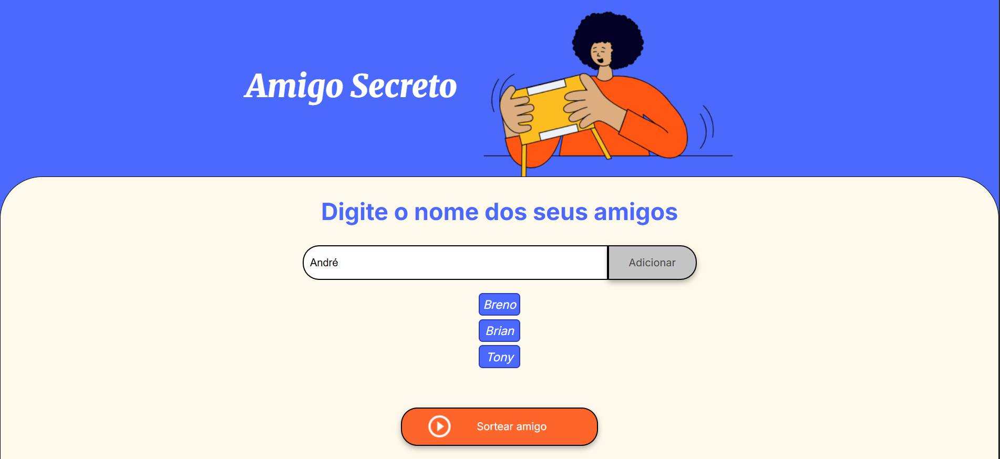

# Amigo Secreto 🎁

## 📓 Descrição
Projeto em JavaScript, HTML e CSS para criar uma lista de amigos e sortear aleatoriamente um nome da lista.  
#Alura #Oracle

## 📸 Preview 

<table>
 <tr>
  <td colspan="2" align="center">
   
  </td>
 </tr>

 <tr>
  <td>
   
  </td>

  <td>
   
  </td>
 </tr>
</table>

## 💡 Funcionalidades 

- Adicionar nomes de amigos
- Sortear um amigo aleatoriamente 
- Exibir a lista com os nomes dos amigos
- Interface Amigável

## 🛠️ Tecnologias usadas

- HTML
- CSS
- JavaScript

## ➡️ Como usar

1. Digite o nome de um amigo no campo de entrada
2. Clique em **"Adicionar"**
3. Após adicionar todos, clique em **"Sortear"**
4. O nome sorteador aparecerá abaixo 

## 📁 Arquivos principais 

- `index.html`: estrutura da página
- `style.css`: estilos visuais 
- `app.js`: lógica em JavaScript 
